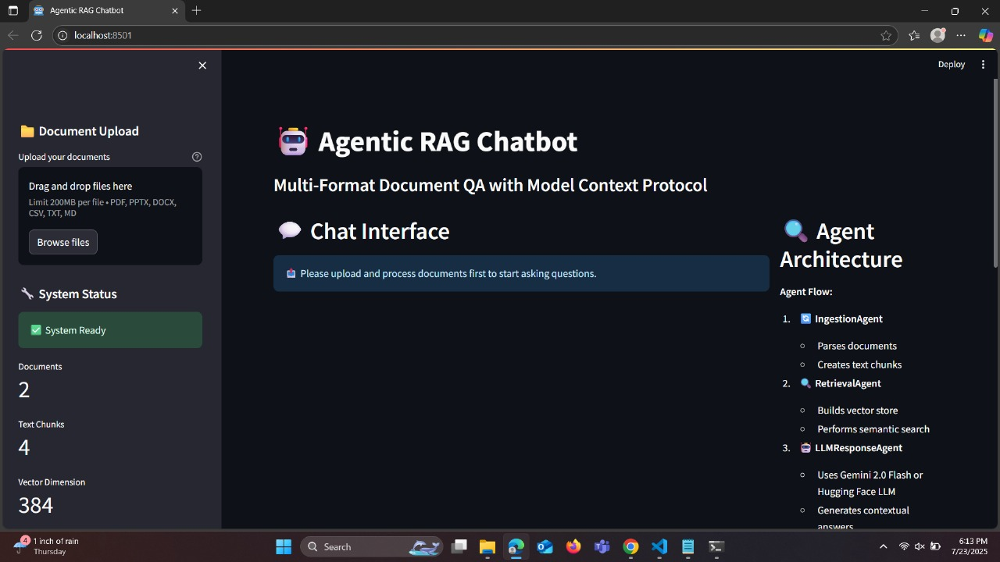
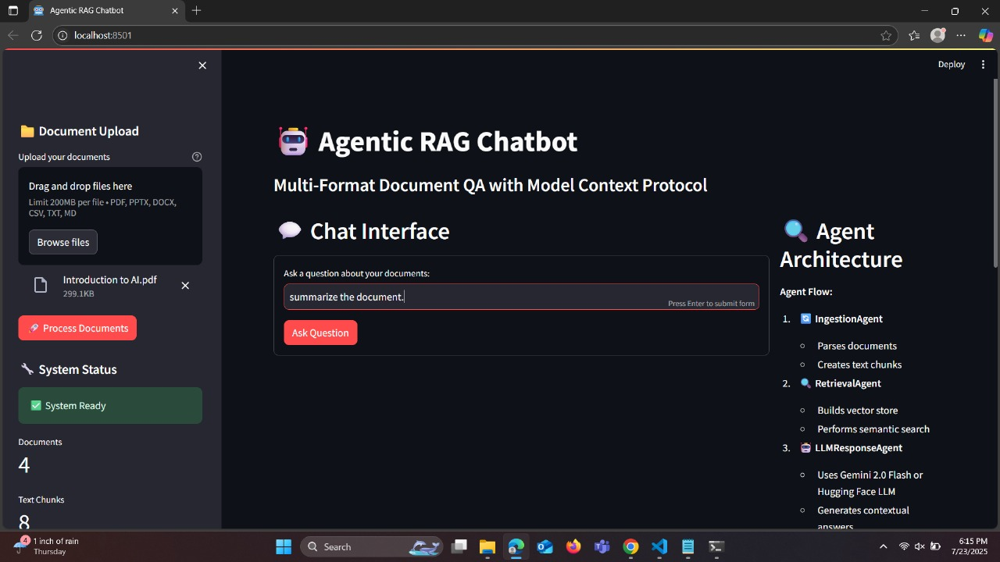
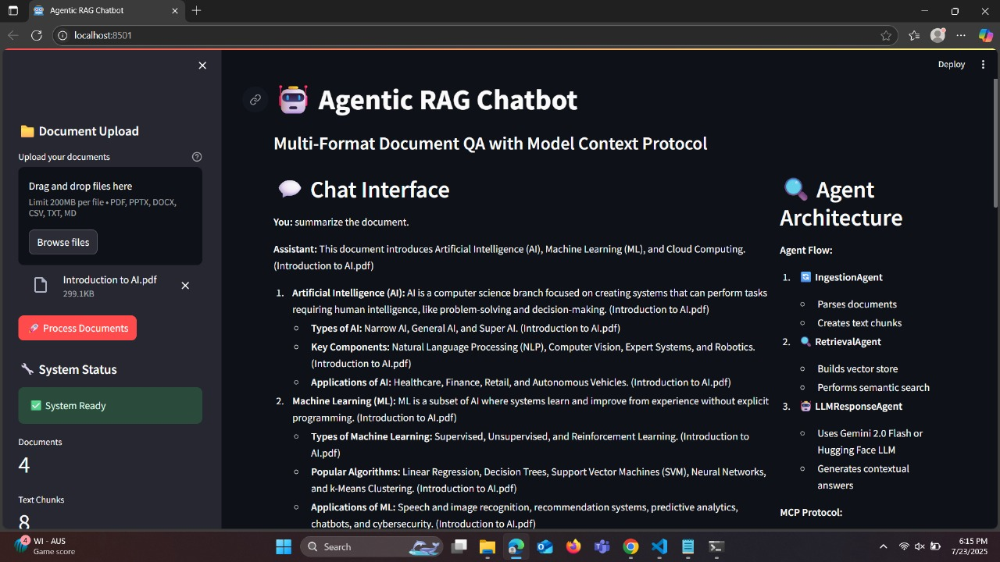

# 🤖 Agentic RAG Chatbot for Multi-Format Document QA

An intelligent chatbot system built with an agentic architecture that can process multiple document formats and answer questions using Retrieval-Augmented Generation (RAG) with Model Context Protocol (MCP) for inter-agent communication.

## 🏗️ Architecture Overview

This system implements a multi-agent architecture with three specialized agents:

- **IngestionAgent**: Parses and preprocesses documents across multiple formats
- **RetrievalAgent**: Handles embedding generation and semantic retrieval using FAISS
- **LLMResponseAgent**: Generates contextual responses using Google Gemini 2.0 Flash
- **CoordinatorAgent**: Orchestrates the entire pipeline and manages agent interactions

### Model Context Protocol (MCP)
All agents communicate through structured MCP messages with trace ID tracking for complete observability:

```json
{
  "sender": "RetrievalAgent",
  "receiver": "LLMResponseAgent", 
  "type": "CONTEXT_RESPONSE",
  "trace_id": "abc-123",
  "payload": {
    "retrieved_context": ["...", "..."],
    "query": "What are the KPIs?"
  }
}
```

## 📁 Project Structure

```
agentic-rag-chatbot/
├── agents/
│   ├── ingestion_agent.py      # Document parsing and preprocessing
│   ├── retrieval_agent.py      # Vector store and semantic search
│   └── llm_response_agent.py   # Response generation with Gemini
├── core/
│   ├── mcp_protocol.py         # Model Context Protocol implementation
│   ├── document_parser.py      # Multi-format document parsers
│   └── vector_store.py         # FAISS-based vector store
├── ui/
│   └── streamlit_app.py        # Streamlit web interface
├── uploads/                    # Uploaded documents storage
├── outputs/                     # Screenshots and outputs
│   ├── homepage.png
│   ├── upload_docs.png
│   └── chat_response.png
├── main.py                     # Main coordinator and entry point
├── requirements.txt            # Python dependencies
└── README.md                   # This file
```

## ✨ Features

### 📄 Multi-Format Document Support
- ✅ **PDF** - Extracts text from all pages
- ✅ **PPTX** - Processes PowerPoint slides and text
- ✅ **DOCX** - Handles Word documents and paragraphs
- ✅ **CSV** - Parses tabular data with intelligent chunking
- ✅ **TXT/MD** - Plain text and Markdown files

### 🤖 Intelligent Agent System
- **Agentic Architecture**: Independent agents with specialized responsibilities
- **MCP Communication**: Structured message passing between agents
- **Trace Tracking**: Complete observability with unique trace IDs
- **Error Handling**: Robust error management across all agents

### 🔍 Advanced Retrieval
- **Semantic Search**: Using SentenceTransformers for embedding generation
- **FAISS Vector Store**: High-performance similarity search
- **Contextual Chunking**: Intelligent text segmentation with overlap
- **Relevance Scoring**: Confidence scores for retrieved context

### 💬 Interactive Chat Interface
- **Multi-turn Conversations**: Maintains chat history
- **Source Attribution**: Shows which documents were used for answers
- **Real-time Processing**: Live status updates during document processing
- **System Management**: Clear system state and restart functionality

## 🚀 Installation & Setup

### Prerequisites
- Python 3.8+
- Google Gemini API Key

### 1. Clone the Repository
```bash
git clone <https://github.com/chakrikaguttameedi/agentic-rag-chatbot>
cd agentic-rag-chatbot
```

### 2. Install Dependencies
```bash
pip install -r requirements.txt
```

### 3. Environment Configuration
Create a `.env` file in the root directory:
```env
GEMINI_API_KEY=your_gemini_api_key_here
```

### 4. Run the Application
```bash
streamlit run ui/streamlit_app.py
```

The application will be available at `http://localhost:8501`

## 📋 Dependencies

```
streamlit==1.28.1
google-genai==0.3.0
faiss-cpu==1.7.4
sentence-transformers==2.2.2
PyPDF2==3.0.1
python-pptx==0.6.21
python-docx==0.8.11
pandas==2.0.3
openpyxl==3.1.2
chromadb==0.4.15
pydantic==2.4.2
typing-extensions==4.8.0
python-dotenv==1.0.0
```

## 🔄 System Workflow

1. **Document Upload**: User uploads documents through Streamlit interface
2. **Ingestion**: IngestionAgent parses documents and creates text chunks
3. **Vector Store**: RetrievalAgent builds FAISS index with embeddings
4. **Query Processing**: User asks questions via chat interface
5. **Retrieval**: RetrievalAgent finds relevant document chunks
6. **Response Generation**: LLMResponseAgent uses Gemini to generate answers
7. **Display**: Results shown with source attribution

### MCP Message Flow Example
```
User Query → CoordinatorAgent → RetrievalAgent → LLMResponseAgent → Response
     ↓              ↓                ↓               ↓
   trace_id    RETRIEVAL_REQ    CONTEXT_RESP   RESPONSE_COMPLETE
```

## 📊 Outputs

### Homepage Interface


### Document Upload Process  


### Chat Response with Sources


## 🛠️ Tech Stack

- **Backend**: Python, Custom Agent Coordination
- **LLM**: Google Gemini 2.0 Flash
- **Vector Database**: FAISS
- **Embeddings**: SentenceTransformers (all-MiniLM-L6-v2)
- **Frontend**: Streamlit
- **Document Processing**: PyPDF2, python-pptx, python-docx, pandas
- **Communication**: Custom MCP implementation

## 🔧 Configuration

### Embedding Model
The system uses `all-MiniLM-L6-v2` by default. To change:
```python
# In vector_store.py
vector_store = VectorStore(model_name="your-preferred-model")
```

### Chunk Size
Modify chunking parameters in `document_parser.py`:
```python
chunks = self._create_chunks(content, chunk_size=500, overlap=50)
```

### Retrieval Parameters
Adjust search parameters in retrieval calls:
```python
results = self.vector_store.search(query, top_k=5)
```

## 🧪 Testing

### Test LLM Connection
```bash
python main.py
```

### Test Individual Agents
```python
from agents.ingestion_agent import IngestionAgent
agent = IngestionAgent()
# Test document processing
```

## 🚧 Challenges Faced

1. **Multi-format Parsing**: Handling different document formats with consistent chunking
2. **MCP Implementation**: Designing efficient message passing between agents
3. **Vector Store Management**: Optimizing FAISS performance for real-time search
4. **Error Handling**: Ensuring robust error management across the agent pipeline
5. **Memory Management**: Handling large documents without memory overflow

## 🔮 Future Improvements

- **Persistent Storage**: Add database support for chat history
- **Advanced Chunking**: Implement semantic chunking strategies
- **Multi-language Support**: Add support for non-English documents
- **Agent Monitoring**: Enhanced logging and monitoring dashboard
- **Scalability**: Distributed agent architecture for high-volume processing
- **Security**: Add user authentication and document encryption

## 🤝 Contributing

1. Fork the repository
2. Create a feature branch
3. Make your changes
4. Add tests if applicable
5. Submit a pull request

## 📄 License

This project is licensed under the MIT License - see the LICENSE file for details.

## 📞 Support

For questions or issues, please:
1. Check existing issues in the repository
2. Create a new issue with detailed description
3. Include error logs and system information

---

Developed using Agentic Architecture and Model Context Protocol.